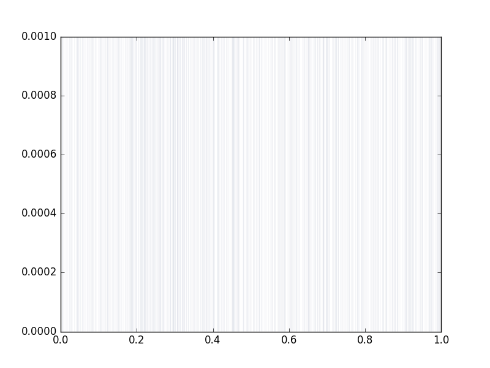
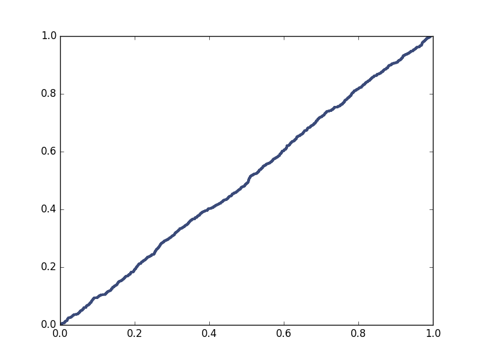

[Think Stats Chapter 4 Exercise 2](http://greenteapress.com/thinkstats2/html/thinkstats2005.html#toc41) (a random distribution)  

The code for this problem is below:  
```  
import thinkstats2
import thinkplot
import random
x = range(1000)
rd = [random.random() for i in x]
pmf = thinkstats2.Pmf(rd)
fig1 =thinkplot.Pmf(pmf,linewidth = 0.01)
thinkplot.show(fig1)

cdf = thinkstats2.Cdf(rd)
thinkplot.Cdf(cdf)
thinkplot.show()

```  
  
  
>> The pmf for the random numbers is below:  
  

The cdf for the random number is below:  

